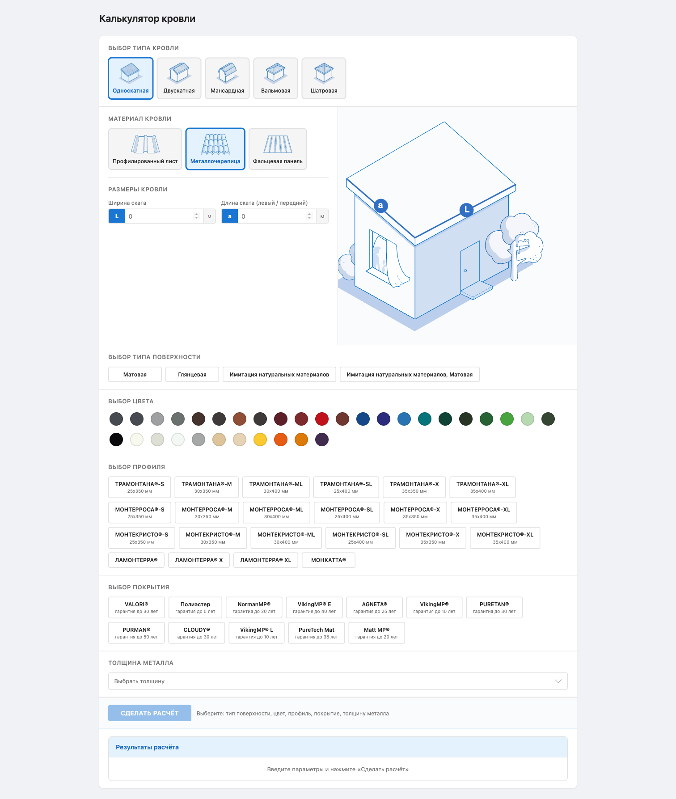

# Roof Calculator Widget

An embeddable React/TypeScript widget for calculating roofing materials. Integrates into any CMS or static site via two files — no server or framework required.



---

## Features

- **5 roof types** — single-slope, double-slope, mansard, hip, pyramid
- **Interactive SVG diagrams** — active parameter highlighted as you type
- **Full material configuration** — surface type, color (RAL palette), profile, coating, metal thickness
- **Instant validation** — all fields checked before calculation runs
- **Stale result banner** — notifies when inputs change after a calculation
- **Mobile responsive** — works at 375 / 768 / 1280 px
- **CMS-safe styles** — widget styles are scoped and don't affect the host page

---

## Tech Stack

| Layer | Technology |
|---|---|
| Framework | React 19 + TypeScript 5 |
| Build | Vite 8 (lib mode, IIFE) |
| Styles | CSS Modules + CSS Variables |
| Diagrams | Inline SVG (React components) |
| Data | Static JSON files |
| Calculation | Pure TypeScript functions |
| Linting | ESLint (typescript-eslint, react, import, prettier) |
| Formatting | Prettier |

---

## Getting Started

```bash
npm install
npm run dev
```

Open [http://localhost:5173](http://localhost:5173) to see the widget in a dev environment.

---

## Project Structure

```
src/
├── widget.tsx              # IIFE entry — auto-mounts into #roof-calc
├── App.tsx                 # Root component
├── data/                   # Static JSON (no backend)
│   ├── materials.json
│   ├── roof-types.json
│   ├── surface-types.json
│   ├── colors.json
│   ├── profiles.json
│   ├── coatings.json
│   └── thickness.json
├── engine/                 # Pure calculation functions (no React)
│   ├── roof.ts
│   └── types.ts
├── components/
│   ├── RoofCalculator/     # Main form + results panel
│   ├── diagrams/           # Inline SVG roof diagrams
│   └── ui/                 # Atomic components
│       ├── ColorSwatch/
│       ├── NumberInput/
│       ├── OptionChip/
│       ├── RadioCard/
│       ├── ResultTable/
│       └── SelectDropdown/
└── styles/
    ├── global.css          # CSS variables, typography
    └── widget.css          # Scoped reset for CMS isolation
```

---

## Scripts

```bash
npm run dev              # Start dev server with HMR
npm run build            # TypeScript check + SPA build
npm run build:widget     # TypeScript check + widget build → dist/
npm run preview          # Preview the SPA build locally
npm run eslint:check     # Run ESLint
npm run eslint:fix       # Run ESLint with auto-fix
npm run prettier:check   # Check formatting
npm run prettier:fix     # Apply formatting
```

---

## Building the Widget

```bash
npm run build:widget
```

Output in `dist/`:

```
dist/
├── widget.js     # ~315 KB (~78 KB gzip) — React + all logic bundled
├── widget.css    # widget styles
└── images/       # roof type images
```

### Test the build locally

```bash
cd dist && python3 -m http.server 8080
# open http://localhost:8080/widget-test.html
```

---

## CMS Integration

See [INTEGRATION.md](INTEGRATION.md) for the full integration guide (upload paths, HTML snippets, browser support).

**Quick start:**

```html
<link rel="stylesheet" href="/assets/calc/widget.css" />

<div id="roof-calc"></div>

<script src="/assets/calc/widget.js"></script>
```
